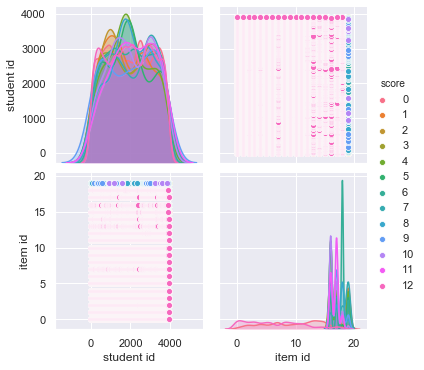
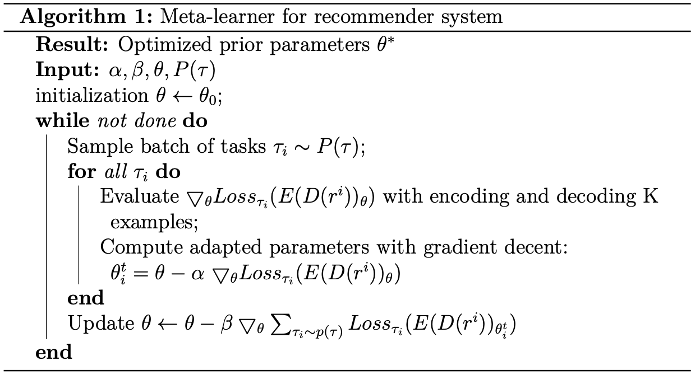

# Data set


```python
import numpy as np
import pandas as pd
import torch
import torch.nn as nn
import random
import torch.utils.data as Data
import matplotlib.pyplot as plt
import seaborn as sns
from sklearn.preprocessing import LabelEncoder
from copy import deepcopy
%matplotlib inline
import progressbar
import math
from sklearn.metrics import accuracy_score, precision_score, recall_score, f1_score, roc_auc_score
from sklearn.model_selection import StratifiedKFold
from sklearn import metrics
```

## Show data set : FrcSub, Math1, Math2


```python
def load_scores_data(file_path):
    student_index = 0
    score_matrix = []
    data = [] 
    f = open(file_path)
    for line in f.readlines():
        scores = line.split()
        scores = [float(i) for i in scores]
        score_matrix.append(scores)
        item_index = 0
        for score in scores:
            data.append([student_index, item_index, score])
            item_index += 1
        student_index += 1
    f.close()
    return data
```


```python
data1 = load_scores_data('./FrcSub/data.txt')
data2 = load_scores_data('./Math1/data.txt')
data3 = load_scores_data('./Math2/data.txt')
from IPython.display import display_html 
df1 = pd.DataFrame(data=data1, columns=['student id', 'item id', 'score'])
df2 = pd.DataFrame(data=data2, columns=['student id', 'item id', 'score'])
df3 = pd.DataFrame(data=data3, columns=['student id', 'item id', 'score'])
df1_styler = df1.head().style.set_table_attributes("style='display:inline'").set_caption('FrbSub')
df2_styler = df2.head().style.set_table_attributes("style='display:inline'").set_caption('Math1')
df3_styler = df3.head().style.set_table_attributes("style='display:inline'").set_caption('Math2')

display_html(df1_styler._repr_html_() + df2_styler._repr_html_() + df3_styler._repr_html_(), raw=True)
```


<style  type="text/css" >
</style><table id="T_3e9300f6_7c97_11ea_9eeb_a45e60f00737" style='display:inline'><caption>FrbSub</caption><thead>    <tr>        <th class="blank level0" ></th>        <th class="col_heading level0 col0" >student id</th>        <th class="col_heading level0 col1" >item id</th>        <th class="col_heading level0 col2" >score</th>    </tr></thead><tbody>
                <tr>
                        <th id="T_3e9300f6_7c97_11ea_9eeb_a45e60f00737level0_row0" class="row_heading level0 row0" >0</th>
                        <td id="T_3e9300f6_7c97_11ea_9eeb_a45e60f00737row0_col0" class="data row0 col0" >0</td>
                        <td id="T_3e9300f6_7c97_11ea_9eeb_a45e60f00737row0_col1" class="data row0 col1" >0</td>
                        <td id="T_3e9300f6_7c97_11ea_9eeb_a45e60f00737row0_col2" class="data row0 col2" >0.000000</td>
            </tr>
            <tr>
                        <th id="T_3e9300f6_7c97_11ea_9eeb_a45e60f00737level0_row1" class="row_heading level0 row1" >1</th>
                        <td id="T_3e9300f6_7c97_11ea_9eeb_a45e60f00737row1_col0" class="data row1 col0" >0</td>
                        <td id="T_3e9300f6_7c97_11ea_9eeb_a45e60f00737row1_col1" class="data row1 col1" >1</td>
                        <td id="T_3e9300f6_7c97_11ea_9eeb_a45e60f00737row1_col2" class="data row1 col2" >0.000000</td>
            </tr>
            <tr>
                        <th id="T_3e9300f6_7c97_11ea_9eeb_a45e60f00737level0_row2" class="row_heading level0 row2" >2</th>
                        <td id="T_3e9300f6_7c97_11ea_9eeb_a45e60f00737row2_col0" class="data row2 col0" >0</td>
                        <td id="T_3e9300f6_7c97_11ea_9eeb_a45e60f00737row2_col1" class="data row2 col1" >2</td>
                        <td id="T_3e9300f6_7c97_11ea_9eeb_a45e60f00737row2_col2" class="data row2 col2" >0.000000</td>
            </tr>
            <tr>
                        <th id="T_3e9300f6_7c97_11ea_9eeb_a45e60f00737level0_row3" class="row_heading level0 row3" >3</th>
                        <td id="T_3e9300f6_7c97_11ea_9eeb_a45e60f00737row3_col0" class="data row3 col0" >0</td>
                        <td id="T_3e9300f6_7c97_11ea_9eeb_a45e60f00737row3_col1" class="data row3 col1" >3</td>
                        <td id="T_3e9300f6_7c97_11ea_9eeb_a45e60f00737row3_col2" class="data row3 col2" >1.000000</td>
            </tr>
            <tr>
                        <th id="T_3e9300f6_7c97_11ea_9eeb_a45e60f00737level0_row4" class="row_heading level0 row4" >4</th>
                        <td id="T_3e9300f6_7c97_11ea_9eeb_a45e60f00737row4_col0" class="data row4 col0" >0</td>
                        <td id="T_3e9300f6_7c97_11ea_9eeb_a45e60f00737row4_col1" class="data row4 col1" >4</td>
                        <td id="T_3e9300f6_7c97_11ea_9eeb_a45e60f00737row4_col2" class="data row4 col2" >0.000000</td>
            </tr>
    </tbody></table><style  type="text/css" >
</style><table id="T_3e934804_7c97_11ea_9eeb_a45e60f00737" style='display:inline'><caption>Math1</caption><thead>    <tr>        <th class="blank level0" ></th>        <th class="col_heading level0 col0" >student id</th>        <th class="col_heading level0 col1" >item id</th>        <th class="col_heading level0 col2" >score</th>    </tr></thead><tbody>
                <tr>
                        <th id="T_3e934804_7c97_11ea_9eeb_a45e60f00737level0_row0" class="row_heading level0 row0" >0</th>
                        <td id="T_3e934804_7c97_11ea_9eeb_a45e60f00737row0_col0" class="data row0 col0" >0</td>
                        <td id="T_3e934804_7c97_11ea_9eeb_a45e60f00737row0_col1" class="data row0 col1" >0</td>
                        <td id="T_3e934804_7c97_11ea_9eeb_a45e60f00737row0_col2" class="data row0 col2" >1.000000</td>
            </tr>
            <tr>
                        <th id="T_3e934804_7c97_11ea_9eeb_a45e60f00737level0_row1" class="row_heading level0 row1" >1</th>
                        <td id="T_3e934804_7c97_11ea_9eeb_a45e60f00737row1_col0" class="data row1 col0" >0</td>
                        <td id="T_3e934804_7c97_11ea_9eeb_a45e60f00737row1_col1" class="data row1 col1" >1</td>
                        <td id="T_3e934804_7c97_11ea_9eeb_a45e60f00737row1_col2" class="data row1 col2" >1.000000</td>
            </tr>
            <tr>
                        <th id="T_3e934804_7c97_11ea_9eeb_a45e60f00737level0_row2" class="row_heading level0 row2" >2</th>
                        <td id="T_3e934804_7c97_11ea_9eeb_a45e60f00737row2_col0" class="data row2 col0" >0</td>
                        <td id="T_3e934804_7c97_11ea_9eeb_a45e60f00737row2_col1" class="data row2 col1" >2</td>
                        <td id="T_3e934804_7c97_11ea_9eeb_a45e60f00737row2_col2" class="data row2 col2" >1.000000</td>
            </tr>
            <tr>
                        <th id="T_3e934804_7c97_11ea_9eeb_a45e60f00737level0_row3" class="row_heading level0 row3" >3</th>
                        <td id="T_3e934804_7c97_11ea_9eeb_a45e60f00737row3_col0" class="data row3 col0" >0</td>
                        <td id="T_3e934804_7c97_11ea_9eeb_a45e60f00737row3_col1" class="data row3 col1" >3</td>
                        <td id="T_3e934804_7c97_11ea_9eeb_a45e60f00737row3_col2" class="data row3 col2" >1.000000</td>
            </tr>
            <tr>
                        <th id="T_3e934804_7c97_11ea_9eeb_a45e60f00737level0_row4" class="row_heading level0 row4" >4</th>
                        <td id="T_3e934804_7c97_11ea_9eeb_a45e60f00737row4_col0" class="data row4 col0" >0</td>
                        <td id="T_3e934804_7c97_11ea_9eeb_a45e60f00737row4_col1" class="data row4 col1" >4</td>
                        <td id="T_3e934804_7c97_11ea_9eeb_a45e60f00737row4_col2" class="data row4 col2" >1.000000</td>
            </tr>
    </tbody></table><style  type="text/css" >
</style><table id="T_3e9384cc_7c97_11ea_9eeb_a45e60f00737" style='display:inline'><caption>Math2</caption><thead>    <tr>        <th class="blank level0" ></th>        <th class="col_heading level0 col0" >student id</th>        <th class="col_heading level0 col1" >item id</th>        <th class="col_heading level0 col2" >score</th>    </tr></thead><tbody>
                <tr>
                        <th id="T_3e9384cc_7c97_11ea_9eeb_a45e60f00737level0_row0" class="row_heading level0 row0" >0</th>
                        <td id="T_3e9384cc_7c97_11ea_9eeb_a45e60f00737row0_col0" class="data row0 col0" >0</td>
                        <td id="T_3e9384cc_7c97_11ea_9eeb_a45e60f00737row0_col1" class="data row0 col1" >0</td>
                        <td id="T_3e9384cc_7c97_11ea_9eeb_a45e60f00737row0_col2" class="data row0 col2" >1.000000</td>
            </tr>
            <tr>
                        <th id="T_3e9384cc_7c97_11ea_9eeb_a45e60f00737level0_row1" class="row_heading level0 row1" >1</th>
                        <td id="T_3e9384cc_7c97_11ea_9eeb_a45e60f00737row1_col0" class="data row1 col0" >0</td>
                        <td id="T_3e9384cc_7c97_11ea_9eeb_a45e60f00737row1_col1" class="data row1 col1" >1</td>
                        <td id="T_3e9384cc_7c97_11ea_9eeb_a45e60f00737row1_col2" class="data row1 col2" >0.000000</td>
            </tr>
            <tr>
                        <th id="T_3e9384cc_7c97_11ea_9eeb_a45e60f00737level0_row2" class="row_heading level0 row2" >2</th>
                        <td id="T_3e9384cc_7c97_11ea_9eeb_a45e60f00737row2_col0" class="data row2 col0" >0</td>
                        <td id="T_3e9384cc_7c97_11ea_9eeb_a45e60f00737row2_col1" class="data row2 col1" >2</td>
                        <td id="T_3e9384cc_7c97_11ea_9eeb_a45e60f00737row2_col2" class="data row2 col2" >0.000000</td>
            </tr>
            <tr>
                        <th id="T_3e9384cc_7c97_11ea_9eeb_a45e60f00737level0_row3" class="row_heading level0 row3" >3</th>
                        <td id="T_3e9384cc_7c97_11ea_9eeb_a45e60f00737row3_col0" class="data row3 col0" >0</td>
                        <td id="T_3e9384cc_7c97_11ea_9eeb_a45e60f00737row3_col1" class="data row3 col1" >3</td>
                        <td id="T_3e9384cc_7c97_11ea_9eeb_a45e60f00737row3_col2" class="data row3 col2" >0.000000</td>
            </tr>
            <tr>
                        <th id="T_3e9384cc_7c97_11ea_9eeb_a45e60f00737level0_row4" class="row_heading level0 row4" >4</th>
                        <td id="T_3e9384cc_7c97_11ea_9eeb_a45e60f00737row4_col0" class="data row4 col0" >0</td>
                        <td id="T_3e9384cc_7c97_11ea_9eeb_a45e60f00737row4_col1" class="data row4 col1" >4</td>
                        <td id="T_3e9384cc_7c97_11ea_9eeb_a45e60f00737row4_col2" class="data row4 col2" >1.000000</td>
            </tr>
    </tbody></table>


```python
df1_styler = df1.describe().style.set_table_attributes("style='display:inline'").set_caption('FrbSub')
df2_styler = df2.describe().style.set_table_attributes("style='display:inline'").set_caption('Math1')
df3_styler = df3.describe().style.set_table_attributes("style='display:inline'").set_caption('Math2')

display_html(df1_styler._repr_html_() + df2_styler._repr_html_() + df3_styler._repr_html_(), raw=True)
```


<style  type="text/css" >
</style><table id="T_4046e890_7c97_11ea_9eeb_a45e60f00737" style='display:inline'><caption>FrbSub</caption><thead>    <tr>        <th class="blank level0" ></th>        <th class="col_heading level0 col0" >student id</th>        <th class="col_heading level0 col1" >item id</th>        <th class="col_heading level0 col2" >score</th>    </tr></thead><tbody>
                <tr>
                        <th id="T_4046e890_7c97_11ea_9eeb_a45e60f00737level0_row0" class="row_heading level0 row0" >count</th>
                        <td id="T_4046e890_7c97_11ea_9eeb_a45e60f00737row0_col0" class="data row0 col0" >10720.000000</td>
                        <td id="T_4046e890_7c97_11ea_9eeb_a45e60f00737row0_col1" class="data row0 col1" >10720.000000</td>
                        <td id="T_4046e890_7c97_11ea_9eeb_a45e60f00737row0_col2" class="data row0 col2" >10720.000000</td>
            </tr>
            <tr>
                        <th id="T_4046e890_7c97_11ea_9eeb_a45e60f00737level0_row1" class="row_heading level0 row1" >mean</th>
                        <td id="T_4046e890_7c97_11ea_9eeb_a45e60f00737row1_col0" class="data row1 col0" >267.500000</td>
                        <td id="T_4046e890_7c97_11ea_9eeb_a45e60f00737row1_col1" class="data row1 col1" >9.500000</td>
                        <td id="T_4046e890_7c97_11ea_9eeb_a45e60f00737row1_col2" class="data row1 col2" >0.533862</td>
            </tr>
            <tr>
                        <th id="T_4046e890_7c97_11ea_9eeb_a45e60f00737level0_row2" class="row_heading level0 row2" >std</th>
                        <td id="T_4046e890_7c97_11ea_9eeb_a45e60f00737row2_col0" class="data row2 col0" >154.736820</td>
                        <td id="T_4046e890_7c97_11ea_9eeb_a45e60f00737row2_col1" class="data row2 col1" >5.766550</td>
                        <td id="T_4046e890_7c97_11ea_9eeb_a45e60f00737row2_col2" class="data row2 col2" >0.498875</td>
            </tr>
            <tr>
                        <th id="T_4046e890_7c97_11ea_9eeb_a45e60f00737level0_row3" class="row_heading level0 row3" >min</th>
                        <td id="T_4046e890_7c97_11ea_9eeb_a45e60f00737row3_col0" class="data row3 col0" >0.000000</td>
                        <td id="T_4046e890_7c97_11ea_9eeb_a45e60f00737row3_col1" class="data row3 col1" >0.000000</td>
                        <td id="T_4046e890_7c97_11ea_9eeb_a45e60f00737row3_col2" class="data row3 col2" >0.000000</td>
            </tr>
            <tr>
                        <th id="T_4046e890_7c97_11ea_9eeb_a45e60f00737level0_row4" class="row_heading level0 row4" >25%</th>
                        <td id="T_4046e890_7c97_11ea_9eeb_a45e60f00737row4_col0" class="data row4 col0" >133.750000</td>
                        <td id="T_4046e890_7c97_11ea_9eeb_a45e60f00737row4_col1" class="data row4 col1" >4.750000</td>
                        <td id="T_4046e890_7c97_11ea_9eeb_a45e60f00737row4_col2" class="data row4 col2" >0.000000</td>
            </tr>
            <tr>
                        <th id="T_4046e890_7c97_11ea_9eeb_a45e60f00737level0_row5" class="row_heading level0 row5" >50%</th>
                        <td id="T_4046e890_7c97_11ea_9eeb_a45e60f00737row5_col0" class="data row5 col0" >267.500000</td>
                        <td id="T_4046e890_7c97_11ea_9eeb_a45e60f00737row5_col1" class="data row5 col1" >9.500000</td>
                        <td id="T_4046e890_7c97_11ea_9eeb_a45e60f00737row5_col2" class="data row5 col2" >1.000000</td>
            </tr>
            <tr>
                        <th id="T_4046e890_7c97_11ea_9eeb_a45e60f00737level0_row6" class="row_heading level0 row6" >75%</th>
                        <td id="T_4046e890_7c97_11ea_9eeb_a45e60f00737row6_col0" class="data row6 col0" >401.250000</td>
                        <td id="T_4046e890_7c97_11ea_9eeb_a45e60f00737row6_col1" class="data row6 col1" >14.250000</td>
                        <td id="T_4046e890_7c97_11ea_9eeb_a45e60f00737row6_col2" class="data row6 col2" >1.000000</td>
            </tr>
            <tr>
                        <th id="T_4046e890_7c97_11ea_9eeb_a45e60f00737level0_row7" class="row_heading level0 row7" >max</th>
                        <td id="T_4046e890_7c97_11ea_9eeb_a45e60f00737row7_col0" class="data row7 col0" >535.000000</td>
                        <td id="T_4046e890_7c97_11ea_9eeb_a45e60f00737row7_col1" class="data row7 col1" >19.000000</td>
                        <td id="T_4046e890_7c97_11ea_9eeb_a45e60f00737row7_col2" class="data row7 col2" >1.000000</td>
            </tr>
    </tbody></table><style  type="text/css" >
</style><table id="T_40476752_7c97_11ea_9eeb_a45e60f00737" style='display:inline'><caption>Math1</caption><thead>    <tr>        <th class="blank level0" ></th>        <th class="col_heading level0 col0" >student id</th>        <th class="col_heading level0 col1" >item id</th>        <th class="col_heading level0 col2" >score</th>    </tr></thead><tbody>
                <tr>
                        <th id="T_40476752_7c97_11ea_9eeb_a45e60f00737level0_row0" class="row_heading level0 row0" >count</th>
                        <td id="T_40476752_7c97_11ea_9eeb_a45e60f00737row0_col0" class="data row0 col0" >84180.000000</td>
                        <td id="T_40476752_7c97_11ea_9eeb_a45e60f00737row0_col1" class="data row0 col1" >84180.000000</td>
                        <td id="T_40476752_7c97_11ea_9eeb_a45e60f00737row0_col2" class="data row0 col2" >84180.000000</td>
            </tr>
            <tr>
                        <th id="T_40476752_7c97_11ea_9eeb_a45e60f00737level0_row1" class="row_heading level0 row1" >mean</th>
                        <td id="T_40476752_7c97_11ea_9eeb_a45e60f00737row1_col0" class="data row1 col0" >2104.000000</td>
                        <td id="T_40476752_7c97_11ea_9eeb_a45e60f00737row1_col1" class="data row1 col1" >9.500000</td>
                        <td id="T_40476752_7c97_11ea_9eeb_a45e60f00737row1_col2" class="data row1 col2" >0.491785</td>
            </tr>
            <tr>
                        <th id="T_40476752_7c97_11ea_9eeb_a45e60f00737level0_row2" class="row_heading level0 row2" >std</th>
                        <td id="T_40476752_7c97_11ea_9eeb_a45e60f00737row2_col0" class="data row2 col0" >1215.040824</td>
                        <td id="T_40476752_7c97_11ea_9eeb_a45e60f00737row2_col1" class="data row2 col1" >5.766316</td>
                        <td id="T_40476752_7c97_11ea_9eeb_a45e60f00737row2_col2" class="data row2 col2" >0.473859</td>
            </tr>
            <tr>
                        <th id="T_40476752_7c97_11ea_9eeb_a45e60f00737level0_row3" class="row_heading level0 row3" >min</th>
                        <td id="T_40476752_7c97_11ea_9eeb_a45e60f00737row3_col0" class="data row3 col0" >0.000000</td>
                        <td id="T_40476752_7c97_11ea_9eeb_a45e60f00737row3_col1" class="data row3 col1" >0.000000</td>
                        <td id="T_40476752_7c97_11ea_9eeb_a45e60f00737row3_col2" class="data row3 col2" >0.000000</td>
            </tr>
            <tr>
                        <th id="T_40476752_7c97_11ea_9eeb_a45e60f00737level0_row4" class="row_heading level0 row4" >25%</th>
                        <td id="T_40476752_7c97_11ea_9eeb_a45e60f00737row4_col0" class="data row4 col0" >1052.000000</td>
                        <td id="T_40476752_7c97_11ea_9eeb_a45e60f00737row4_col1" class="data row4 col1" >4.750000</td>
                        <td id="T_40476752_7c97_11ea_9eeb_a45e60f00737row4_col2" class="data row4 col2" >0.000000</td>
            </tr>
            <tr>
                        <th id="T_40476752_7c97_11ea_9eeb_a45e60f00737level0_row5" class="row_heading level0 row5" >50%</th>
                        <td id="T_40476752_7c97_11ea_9eeb_a45e60f00737row5_col0" class="data row5 col0" >2104.000000</td>
                        <td id="T_40476752_7c97_11ea_9eeb_a45e60f00737row5_col1" class="data row5 col1" >9.500000</td>
                        <td id="T_40476752_7c97_11ea_9eeb_a45e60f00737row5_col2" class="data row5 col2" >0.375000</td>
            </tr>
            <tr>
                        <th id="T_40476752_7c97_11ea_9eeb_a45e60f00737level0_row6" class="row_heading level0 row6" >75%</th>
                        <td id="T_40476752_7c97_11ea_9eeb_a45e60f00737row6_col0" class="data row6 col0" >3156.000000</td>
                        <td id="T_40476752_7c97_11ea_9eeb_a45e60f00737row6_col1" class="data row6 col1" >14.250000</td>
                        <td id="T_40476752_7c97_11ea_9eeb_a45e60f00737row6_col2" class="data row6 col2" >1.000000</td>
            </tr>
            <tr>
                        <th id="T_40476752_7c97_11ea_9eeb_a45e60f00737level0_row7" class="row_heading level0 row7" >max</th>
                        <td id="T_40476752_7c97_11ea_9eeb_a45e60f00737row7_col0" class="data row7 col0" >4208.000000</td>
                        <td id="T_40476752_7c97_11ea_9eeb_a45e60f00737row7_col1" class="data row7 col1" >19.000000</td>
                        <td id="T_40476752_7c97_11ea_9eeb_a45e60f00737row7_col2" class="data row7 col2" >1.000000</td>
            </tr>
    </tbody></table><style  type="text/css" >
</style><table id="T_404915e8_7c97_11ea_9eeb_a45e60f00737" style='display:inline'><caption>Math2</caption><thead>    <tr>        <th class="blank level0" ></th>        <th class="col_heading level0 col0" >student id</th>        <th class="col_heading level0 col1" >item id</th>        <th class="col_heading level0 col2" >score</th>    </tr></thead><tbody>
                <tr>
                        <th id="T_404915e8_7c97_11ea_9eeb_a45e60f00737level0_row0" class="row_heading level0 row0" >count</th>
                        <td id="T_404915e8_7c97_11ea_9eeb_a45e60f00737row0_col0" class="data row0 col0" >78220.000000</td>
                        <td id="T_404915e8_7c97_11ea_9eeb_a45e60f00737row0_col1" class="data row0 col1" >78220.000000</td>
                        <td id="T_404915e8_7c97_11ea_9eeb_a45e60f00737row0_col2" class="data row0 col2" >78220.000000</td>
            </tr>
            <tr>
                        <th id="T_404915e8_7c97_11ea_9eeb_a45e60f00737level0_row1" class="row_heading level0 row1" >mean</th>
                        <td id="T_404915e8_7c97_11ea_9eeb_a45e60f00737row1_col0" class="data row1 col0" >1955.000000</td>
                        <td id="T_404915e8_7c97_11ea_9eeb_a45e60f00737row1_col1" class="data row1 col1" >9.500000</td>
                        <td id="T_404915e8_7c97_11ea_9eeb_a45e60f00737row1_col2" class="data row1 col2" >0.465612</td>
            </tr>
            <tr>
                        <th id="T_404915e8_7c97_11ea_9eeb_a45e60f00737level0_row2" class="row_heading level0 row2" >std</th>
                        <td id="T_404915e8_7c97_11ea_9eeb_a45e60f00737row2_col0" class="data row2 col0" >1129.015631</td>
                        <td id="T_404915e8_7c97_11ea_9eeb_a45e60f00737row2_col1" class="data row2 col1" >5.766318</td>
                        <td id="T_404915e8_7c97_11ea_9eeb_a45e60f00737row2_col2" class="data row2 col2" >0.474361</td>
            </tr>
            <tr>
                        <th id="T_404915e8_7c97_11ea_9eeb_a45e60f00737level0_row3" class="row_heading level0 row3" >min</th>
                        <td id="T_404915e8_7c97_11ea_9eeb_a45e60f00737row3_col0" class="data row3 col0" >0.000000</td>
                        <td id="T_404915e8_7c97_11ea_9eeb_a45e60f00737row3_col1" class="data row3 col1" >0.000000</td>
                        <td id="T_404915e8_7c97_11ea_9eeb_a45e60f00737row3_col2" class="data row3 col2" >0.000000</td>
            </tr>
            <tr>
                        <th id="T_404915e8_7c97_11ea_9eeb_a45e60f00737level0_row4" class="row_heading level0 row4" >25%</th>
                        <td id="T_404915e8_7c97_11ea_9eeb_a45e60f00737row4_col0" class="data row4 col0" >977.000000</td>
                        <td id="T_404915e8_7c97_11ea_9eeb_a45e60f00737row4_col1" class="data row4 col1" >4.750000</td>
                        <td id="T_404915e8_7c97_11ea_9eeb_a45e60f00737row4_col2" class="data row4 col2" >0.000000</td>
            </tr>
            <tr>
                        <th id="T_404915e8_7c97_11ea_9eeb_a45e60f00737level0_row5" class="row_heading level0 row5" >50%</th>
                        <td id="T_404915e8_7c97_11ea_9eeb_a45e60f00737row5_col0" class="data row5 col0" >1955.000000</td>
                        <td id="T_404915e8_7c97_11ea_9eeb_a45e60f00737row5_col1" class="data row5 col1" >9.500000</td>
                        <td id="T_404915e8_7c97_11ea_9eeb_a45e60f00737row5_col2" class="data row5 col2" >0.250000</td>
            </tr>
            <tr>
                        <th id="T_404915e8_7c97_11ea_9eeb_a45e60f00737level0_row6" class="row_heading level0 row6" >75%</th>
                        <td id="T_404915e8_7c97_11ea_9eeb_a45e60f00737row6_col0" class="data row6 col0" >2933.000000</td>
                        <td id="T_404915e8_7c97_11ea_9eeb_a45e60f00737row6_col1" class="data row6 col1" >14.250000</td>
                        <td id="T_404915e8_7c97_11ea_9eeb_a45e60f00737row6_col2" class="data row6 col2" >1.000000</td>
            </tr>
            <tr>
                        <th id="T_404915e8_7c97_11ea_9eeb_a45e60f00737level0_row7" class="row_heading level0 row7" >max</th>
                        <td id="T_404915e8_7c97_11ea_9eeb_a45e60f00737row7_col0" class="data row7 col0" >3910.000000</td>
                        <td id="T_404915e8_7c97_11ea_9eeb_a45e60f00737row7_col1" class="data row7 col1" >19.000000</td>
                        <td id="T_404915e8_7c97_11ea_9eeb_a45e60f00737row7_col2" class="data row7 col2" >1.000000</td>
            </tr>
    </tbody></table>


```python
sns.set(style="darkgrid")
sns.pairplot(dt3, hue="score")
```


    <seaborn.axisgrid.PairGrid at 0x1a37435810>





```python
fig, axes = plt.subplots(1,3,figsize=(20, 5))
axes[0].set_title('Score distribution of FrbSub')
axes[1].set_title('Score distribution of Math1')
axes[2].set_title('Score distribution of Math2')
sns.countplot(df1['score'].values.round(1), ax=axes[0])
sns.countplot(df2['score'].values.round(1), ax=axes[1])
sns.countplot(df3['score'].values.round(1), ax=axes[2])
```


    <matplotlib.axes._subplots.AxesSubplot at 0x1a29a5dfd0>


```python
fig, ax = plt.subplots(1,3,figsize=(20, 5))
le1 = LabelEncoder()
dt1 = df1.apply(le1.fit_transform)
le2 = LabelEncoder()
dt2 = df2.apply(le2.fit_transform)
le3 = LabelEncoder()
dt3 = df3.apply(le3.fit_transform)
sns.heatmap(dt1.corr(), ax=ax[0])
sns.heatmap(dt2.corr(), ax=ax[1])
sns.heatmap(dt3.corr(), ax=ax[2])
```


    <matplotlib.axes._subplots.AxesSubplot at 0x1a2f51cfd0>


## load data => shuffle, split, sample


```python
def load_data(file_path, train_ratio):
    
    datas = []
    scores = pd.read_csv(file_path, header=None, sep='\t').values
    num_students, num_items, num_total_scores = scores.shape[0], scores.shape[1], scores.shape[0] * scores.shape[1]
    
    student_train_set = set()
    student_test_set = set()
    item_train_set = set()
    item_test_set = set()
    
    train_scores = np.zeros(scores.shape)
    test_scores = np.zeros(scores.shape)
    train_mask_scores = np.zeros(scores.shape)
    test_mask_scores = np.zeros(scores.shape)
    
    
    #先把认知诊断数据集转化成推荐系统中常用的三元组形式
    student_index = 0
    for line in scores:
        item_index = 0
        for score in line:
            datas.append([student_index, item_index, score.item()])
            item_index += 1
        student_index += 1
    
    #Shuffle data index
    #random_perm_index = np.arange(num_total_scores)
    random_perm_index = np.random.permutation(num_total_scores)
    train_index = random_perm_index[0 : int(num_total_scores * train_ratio)]
    test_index = random_perm_index[int(num_total_scores * train_ratio): ]
    
    #Train data (with valid data)
    for index in train_index:
        line = datas[index]
        student_index, item_index, score = line[0], line[1], line[2]
        train_scores[student_index, item_index] = score
        train_mask_scores[student_index, item_index] = 1
        student_train_set.add(student_index)
        item_train_set.add(item_index)
    
    #Test data
    for index in test_index:
        line = datas[index]
        student_index, item_index, score = line[0], line[1], line[2]
        test_scores[student_index, item_index] = score
        test_mask_scores[student_index, item_index] = 1
        student_test_set.add(student_index)
        item_test_set.add(item_index)
    
    return train_scores, test_scores, train_mask_scores, test_mask_scores,\
           student_train_set, item_train_set, student_test_set, item_test_set, \
           num_students, num_items, num_total_scores

    
def shuffle_data(x, x_mask, y):
    num_sample = len(x)
    indices = list(range(num_sample))
    random.shuffle(indices)
    return x[indices], x_mask[indices], y[indices]

def split_data(x, x_mask, y, ratio):
    x_train = x[ : int(len(x) * ratio)]
    x_train_mask = x_mask[ : int(len(x_mask) * ratio)]
    y_train = y[ : int(len(y) * ratio)]
    
    x_test = x[int(len(x) * ratio) : ]
    x_test_mask = x_mask[int(len(x_mask) * ratio) : ]
    y_test = y[int(len(y) * ratio) : ]
    
    return x_train, x_train_mask, y_train, x_test, x_test_mask, y_test

def sample_data(x, x_mask, y, k):
    x, x_mask, y = shuffle_data(x, x_mask, y)
    x_sample = x[ : k]
    x_sample_mask = x_mask[ : k]
    y_sample = y[ : k]
    return x_sample, x_sample_mask, y_sample
```

## AutoEncoder
encode item to anilities or knowledge statement\
decode them back to corresponding item for recommendation


```python
#item-based-AutoRec
class AutoRec(nn.Module):
    
    def __init__(self, num_students, num_items):
        super(AutoRec, self).__init__()
        #self.args = args
        self.num_students = num_students
        self.num_items = num_items
        self.hidden_units = 500
        self.encoder = nn.Sequential(
            nn.Linear(self.num_items, self.hidden_units),
            nn.Sigmoid()
        )

        self.decoder = nn.Sequential(
            nn.Linear(self.hidden_units, self.num_items),
        )
        
    def forward(self, x):

        encoded = self.encoder(x)
        decoded = self.decoder(encoded)
        return decoded  
```

## meta-learning
Let $\theta$ be the parameters that represent weights of encoder and decoder.
Given a task $\tau_i$ based on dataset $\mathcal{D}_{train}, \mathcal{D}_{test}$, we can update the parameters of encoder and decoder:
\begin{gather}
    \theta^t_i \gets \theta - \bigtriangledown_{\theta}Loss_{\tau_i}(E(D(r^i))_{\theta})
\end{gather}
where $\alpha$ is learning rate of each task and the $Loss$ denotes the loss computed using the mini data batch of each task.
To achieve promising generalization across a variety of tasks, our goal is to find optimal $\theta_i$:
\begin{gather}
    \theta_i \gets \mathop{\arg\min}_{\theta} \sum Loss_{\tau_i}(E(D(r^i))_{{\theta}^t_i})
\end{gather}

### here we choose the First-Order MAML, the algorithm is following:




```python
class MAML(object):
    def __init__(self, x, x_mask, y, model, optimizer, train_loader):
        
        self.x_ = x
        self.x_mask_ = x_mask
        self.y_ = y
        self.model_ = model
        self.optimizer_ = optimizer
        self.train_loader_ = train_loader
        self.num_tasks = 20
        self.num_samples = 20
        self.task_epochs = 100
        self.alpha = 1e-5
        self.beta = 1e-5
        self.lam = 1e-3
        self.train_epochs = 100
        self.batch_size = 100
        
        #绘制图像所需参数
        self.trainLoss_ = []
        self.trainRmse_ = []
       
    def train_task(self, x_task, x_task_mask, y_task):
        decoded = self.model_(x_task)
        loss, _ = self.get_loss_rmse(decoded, x_task, x_task_mask)
        #loss = ((decoded - x_task) * x_task_mask).pow(2).sum()
        self.model_.zero_grad()
        loss.backward()
        self.optimizer_.step()
        
    def learn_algorithm(self):
        
        print("Learning an algorithm by meta-learning....")
        
        
        #task_loader = Data.DataLoader(dataset=train_dataset, batch_size=self.num_tasks, shuffle=True)
        
        for e in range(self.task_epochs):        
            
            self.opti_params_ = []

            #for train task i in batch of tasks
            for i in range(self.num_tasks):
                
                
                x_task, x_task_mask, y_task = sample_data(self.x_, self.x_mask_, self.y_, self.num_samples)
                x_task, x_task_mask, y_task = torch.tensor(x_task).type(torch.FloatTensor), torch.tensor(x_task_mask).type(torch.FloatTensor), torch.tensor(y_task).type(torch.FloatTensor)
    
                self.train_task(x_task, x_task_mask, y_task)
                
                opti_params = deepcopy(self.model_.state_dict())
                
                self.opti_params_.append(opti_params)
            
                
            meta_grad_dict = deepcopy(self.model_.state_dict())
            meta_grad_dict = {name: nn.init.constant_(meta_grad_dict[name], 0.) for name in meta_grad_dict} 
            
            
            
            for i in range(self.num_tasks):
                
                
                x_task, x_task_mask, y_task = sample_data(self.x_, self.x_mask_, self.y_, self.num_samples)
                x_task, x_task_mask, y_task = torch.tensor(x_task).type(torch.FloatTensor), torch.tensor(x_task_mask).type(torch.FloatTensor), torch.tensor(y_task).type(torch.FloatTensor)
    
                net_optim = AutoRec(num_students, num_items)
                
                net_optim.load_state_dict(self.opti_params_[i])
                
                decoded = net_optim(x_task)
                
                loss, _ = self.get_loss_rmse(decoded, x_task, x_task_mask)
                
                #loss = ((decoded - x_task) * x_task_mask).pow(2).sum()
                
                loss.backward()

                
                #update meta gradient bt net_optim_params's grad
                net_optim_params_grad = {}
                for name, params in zip(net_optim.state_dict(), net_optim.parameters()):
                    net_optim_params_grad[name] = params.grad.data
                #print(net_optim_params_grad)
                meta_grad_dict = {name: meta_grad_dict[name] + net_optim_params_grad[name] / self.num_samples for name in meta_grad_dict} 
                
                #state_dict() has no grad
                #meta_grad_dict = {name: meta_grad_dict[name] + net_optim_params[name].grad.data / self.num_samples for name in meta_grad_dict} 
            
            
            #update net params by meta gradient
            net_params = self.model_.state_dict()
            net_params_new = {name: net_params[name] + self.beta * meta_grad_dict[name] / self.num_samples for name in net_params} 
            self.model_.load_state_dict(net_params_new)
          
        
    def get_loss_rmse(self, decoded, x_batch, x_batch_mask):
        
        loss_basic = 0
        loss_regular = 0
        
        #basic loss
        loss_basic += ((decoded - x_batch) * x_batch_mask).pow(2).sum()
        rmse = loss_basic
        
        
        #regular loss
        for dict_params in self.optimizer_.param_groups:
            for params in dict_params['params']:
                # print(type(j.data), j.shape,j.data.dim())
                # W.l2_normal, V.l2_normal
                if params.data.dim() == 2:
                    loss_regular += torch.t(params.data).pow(2).sum()
        
        #total loss
        loss = loss_basic + loss_regular * self.lam * 0.5
        return loss, rmse
    
    def get_test_error(self, decoded, x_batch, x_batch_mask):
        return ((decoded - x_batch) * x_batch_mask).pow(2).sum()
    
    def train_batch(self):
        Rmse = 0
        Loss = 0
        for step, (x_batch, x_batch_mask, y_batch) in enumerate(self.train_loader_):
            
            x_batch = x_batch.type(torch.FloatTensor)#.cuda()
            x_batch_mask = x_batch_mask.type(torch.FloatTensor)#.cuda()
            
            decoded = self.model_(x_batch) #x_batch.shape = [100, 20] = decoded
            loss, rmse = self.get_loss_rmse(decoded=decoded, x_batch=x_batch, x_batch_mask=x_batch_mask)
            self.optimizer_.zero_grad()
            loss.backward()
            self.optimizer_.step()
            Loss += loss
            Rmse += rmse

        Rmse = np.sqrt(Rmse.detach().cpu().numpy() / (train_mask_scores == 1).sum())
        
        self.trainLoss_.append(Loss)
        self.trainRmse_.append(Rmse)

        #print('epoch ', epoch,  '| train Rmse : ', Rmse)
    
    def train(self):
        bar = progressbar.ProgressBar()
        for epoch in bar(range(self.train_epochs)):
            self.train_batch()
            
    def predict(self):
        test_scores_ = torch.from_numpy(test_scores).type(torch.FloatTensor)#.cuda()
        test_mask_scores_ = torch.from_numpy(test_mask_scores).type(torch.FloatTensor)#.cuda()
        
        scores_predict = self.model_(test_scores_)
        error = self.get_test_error(scores_predict, test_scores_, test_mask_scores_)
        error = np.sqrt(error.detach().cpu().numpy() / (test_mask_scores == 1).sum())
        return error

    def draw_train_loss(self):
        fig, ax = plt.subplots()
        ax.set_title("Train Loss")
        ax.plot(self.trainLoss_, label='Train Loss')
        ax.legend()
        
    def draw_train_rmse(self):
        fig, ax = plt.subplots()
        ax.set_title("Train Rmse")
        ax.plot(self.trainRmse_, label='Train Rmse')
        ax.legend()
        
    def classify(self, pred_value):
        if pred_value <= 0.5:
            pred_value = 0
        else:
            pred_value = 1
        return pred_value
    

    
    def get_scores(self, test_scores, test_mask_scores):
        
        test_scores_ = torch.from_numpy(test_scores).type(torch.FloatTensor)#.cuda()
        predict_scores_ = self.model_(test_scores_).detach().numpy()
        
        
        pred_scores = predict_scores_[test_mask_scores == 1]
        true_scores = test_scores_[test_mask_scores == 1]
        

        
        true_scores[true_scores > 0.5] = 1
        true_scores[true_scores <= 0.5] = 0
        
        fpr, tpr, thresholds = metrics.roc_curve(true_scores, pred_scores)
        
        pred_scores[pred_scores > 0.5] = 1
        pred_scores[pred_scores <= 0.5] = 0

        accuracy = accuracy_score(true_scores, pred_scores)
        precision = precision_score(true_scores, pred_scores)
        recall = recall_score(true_scores, pred_scores)
        f1 = f1_score(true_scores, pred_scores)
        roc_auc = roc_auc_score(true_scores, pred_scores)
        
        return accuracy, precision, recall, f1, fpr, tpr, thresholds, roc_auc
```


```python
def show_roc_curve(fpr_, tpr_, roc_auc_):
    fig, ax = plt.subplots()
    ax.set_title('Receiver Operating Characteristic')
    ax.plot(fpr_[0], tpr_[0], alpha=0.7, color='darkorange', lw=2, label='ROC curve Auto(area = %0.3f)' % roc_auc_[0])
    ax.plot(fpr_[1], tpr_[1], alpha=0.7, color='r', lw=2, label='ROC curve meta-Auto(area = %0.3f)' % roc_auc_[1])
    ax.plot([0, 1], [0, 1], color='navy', lw=2, linestyle='--')
    ax.set_xlim([-0.01, 1.0])
    ax.set_ylim([-0.01, 1.05])
    ax.set_xlabel('False Positive Rate')
    ax.set_ylabel('True Positive Rate')
    ax.legend(loc='lower right')
```


```python
def show_rmse(rmse_):
    fig, ax = plt.subplots()
    ax.set_title('Root Mean Square Error')
    ax.plot(rmse_[0], alpha=0.7, color='darkorange', lw=2, label='Train by Auto(start rmse = %0.3f)' % rmse_[0][0])
    ax.plot(rmse_[1], alpha=0.7, color='r', lw=2, label='Train by meta-Auto(start rmse = %0.3f)' % rmse_[1][0])
    ax.set_xlabel('Epoch')
    ax.set_ylabel('Rmse')
    ax.legend()
```


```python
def train_model(file_path, ratio=0.01, batch_size=100):
    
    train_scores, test_scores, train_mask_scores, test_mask_scores,\
    student_train_set, item_train_set, student_test_set, item_test_set, \
    num_students, num_items, num_total_scores = load_data(file_path, ratio)
    
    num_batch = int(math.ceil(num_students / batch_size))
    
    model_auto = AutoRec(num_students, num_items)
    optimizer_auto = torch.optim.Adam(model_auto.parameters(), lr = 1e-3, weight_decay=1e-5)
    model_meta = deepcopy(model_auto)
    optimizer_meta = torch.optim.Adam(model_meta.parameters(), lr = 1e-4, weight_decay=1e-6)
    
    train_dataset = Data.TensorDataset(torch.from_numpy(train_scores),torch.from_numpy(train_mask_scores),torch.from_numpy(train_scores))
    train_loader = Data.DataLoader(dataset=train_dataset, batch_size=batch_size, shuffle=True)
    
    auto = MAML(train_scores, train_mask_scores, train_scores, model_auto, optimizer_auto, train_loader)
    meta = MAML(train_scores, train_mask_scores, train_scores, model_meta, optimizer_meta, train_loader)
    
    auto.train()
    meta.train_epochs=1000
    meta.learn_algorithm()
    meta.train()
    
    return auto, meta
```


```python
#Train on FrbSub
auto1, meta1 = train_model('./FrcSub/data.txt', ratio=0.01, batch_size=100)
```

    100% |########################################################################|


    Learning an algorithm by meta-learning....


    100% |########################################################################|


```python
#Train on Math1
auto2, meta2 = train_model('./Math1/data.txt', ratio=0.01, batch_size=100)
```

    100% |########################################################################|


    Learning an algorithm by meta-learning....


    100% |########################################################################|


```python
#Train on Math2
auto3, meta3 = train_model('./Math2/data.txt', ratio=0.01, batch_size=100)
```

    100% |########################################################################|


    Learning an algorithm by meta-learning....


    100% |########################################################################|


```python
def show_result(auto, meta):
    
    tpr_, fpr_, roc_auc_ = [], [], []
    accuracy, precision, recall, f1, fpr, tpr, thresholds, roc_auc = auto.get_scores(test_scores, test_mask_scores)
    tpr_.append(tpr)
    fpr_.append(fpr)
    roc_auc_.append(roc_auc)
    print("------------------------Autoencoder-----------------------------")
    print("Accuracy: {:4.6f} | precision: {:4.6f} | recall: {:4.6f} | F1: {:4.6f} | AUC: {:4.6f}".format(accuracy, precision, recall, f1, roc_auc))

    accuracy, precision, recall, f1, fpr, tpr, thresholds, roc_auc = meta.get_scores(test_scores, test_mask_scores)
    tpr_.append(tpr)
    fpr_.append(fpr)
    roc_auc_.append(roc_auc)
    print("----------------------meta-Autoencoder--------------------------")
    print("Accuracy: {:4.6f} | precision: {:4.6f} | recall: {:4.6f} | F1: {:4.6f} | AUC: {:4.6f}".format(accuracy, precision, recall, f1, roc_auc))

    show_roc_curve(fpr_, tpr_, roc_auc_)
```


```python
print("Recommendation model on FrbSub: ")
show_result(auto1, meta1)
```

    Recommendation model on FrbSub: 
    ------------------------Autoencoder-----------------------------
    Accuracy: 0.895813 | precision: 0.827605 | recall: 0.962340 | F1: 0.889902 | AUC: 0.903201
    ----------------------meta-Autoencoder--------------------------
    Accuracy: 0.902206 | precision: 0.837234 | recall: 0.963875 | F1: 0.896102 | AUC: 0.909054


```python
print("Recommendation model on Math1: ")
show_result(auto2, meta2)
```

    Recommendation model on Math1: 
    ------------------------Autoencoder-----------------------------
    Accuracy: 0.968956 | precision: 0.979263 | recall: 0.949147 | F1: 0.963970 | AUC: 0.966756
    ----------------------meta-Autoencoder--------------------------
    Accuracy: 0.973372 | precision: 0.976547 | recall: 0.962251 | F1: 0.969346 | AUC: 0.972137


```python
print("Recommendation model on Math2: ")
show_result(auto3, meta3)
```

    Recommendation model on Math2: 
    ------------------------Autoencoder-----------------------------
    Accuracy: 0.979028 | precision: 0.978776 | recall: 0.973172 | F1: 0.975966 | AUC: 0.978378
    ----------------------meta-Autoencoder--------------------------
    Accuracy: 0.978770 | precision: 0.974758 | recall: 0.976772 | F1: 0.975764 | AUC: 0.978548


```python
rmse_ = []
rmse_.append(auto1.trainRmse_[:20])
rmse_.append(meta1.trainRmse_[:20])
show_rmse(rmse_)
```


# From the demo we can see:

## With the meta-learning (red line) enhancement, the error Rsme is already very small at the initial stage of training which means it started faster.

## If training multiple times with enough data, the final prediction results (ROC red orange curve) of the two methods are very close.
